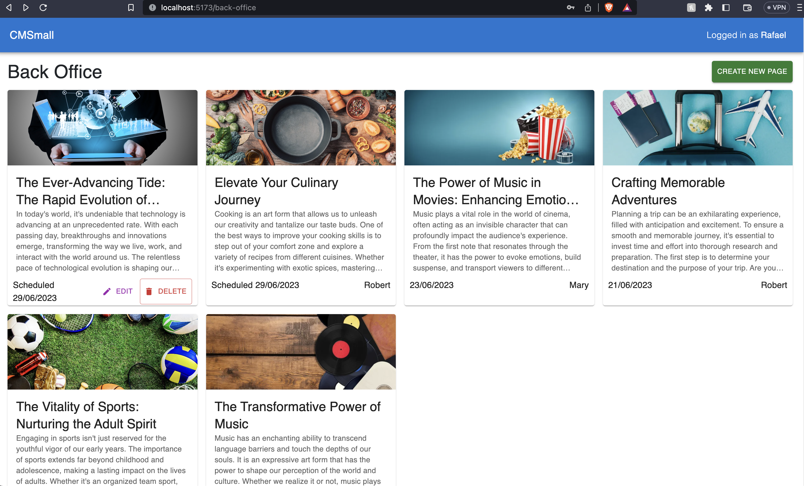
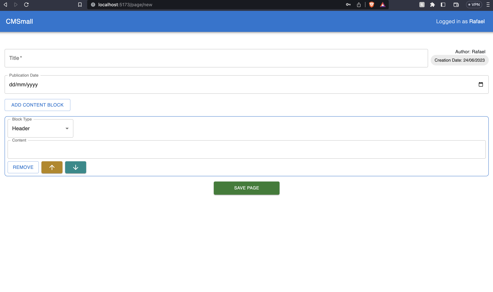

# Exam #1: "CMSmall"

## Student: s312401 LAPETINA RIBEIRO GOMES RAFAEL

## React Client Application Routes

- Route `/`: Home page. Any user (authenticated or not) can see a list of all published pages created by all users. Params passed throught props: user object (the logged in user) and all published pages.
- Route `/back-office`: Back office page. Authenticated users can see a list of all pages created by all users. User can click to delete or edit (taken to another route) his/hers pages. Admin user can edit or delete any page. Params passed throught props: user object (the logged in user), all pages and deletePage function.
- Route `/login`: Login page. Perform authentication using username and password. Params passed throught props: handleLogin function.
- Route `/signup`: Signup page. Create user by providing username, email and password. Params passed throught props: registerUser function.
- Route `/page/new`: New page creation. Authenticated user can create a new Page with content blocks in this page. Params passed throught props: user object (the logged in user), setMessage function (responsible to show the snackBar message) and addNewOrEditPage function.
- Route `/page/:id/edit`: Page edition. Authenticated user can edit a Page with content blocks in this page. Params passed throught props: user object (the logged in user), setMessage function (responsible to show the snackBar message) and addNewOrEditPage function. This route uses the useLocation() React function to retrieve parameters pushed using useNavigate (specifically the PageContent object)
- Route `/page/:id`: The visualization of the specific page with its contents. Param `:id` is the page identification. This route uses the useLocation() React function to retrieve parameters pushed using useNavigate (specifically the PageContent object)
- Route `*`: Page 404 not found, in case any other unreachable routes are typed into web browser

## API Server

In the `index.js` file there are the following endpoints. The logic is separated in three main folders. The `routes` folder contains the routes related to certain entity, the `controller` folder has the logic for the route and the `services` folder contains the database queries that can be reused by different controllers and provide a higher level of abstraction.

`/api/session`:

- POST `/login`
  - request body content: creadentials with username and password
  - response: 201 Created (success) with user object or 401 Unauthorized (failure) with error message
- GET `/current`
  - request body content: none
  - response: 200 OK (success) with user object or 401 Unauthorized (failure) with error message
- DELETE `/current`
  - request body content: none
  - response: 200 OK (success)
- GET `/register`
  - request body content: json object with username, email and password
  - response: 201 Created (success) with user object or 401 Unauthorized (failure) with error message

`/api/users`:

- POST `/all`
  - request body content: none
  - response: 200 OK (success) with list of user object or 401 Unauthorized (failure) with error message

`/api/pages`:

- POST `/add`
  - request body content: json object with page object
  - response: 200 OK (success) with page object. 401 Unauthorized (failure) with error message. 400 Bad Request (failure) if invalid request body content. 500 Internal Server Error (failure) if database error with error message.
- GET `/all`

  - request body content: none
  - response body content: 200 OK (success) with json object with list of all pages or 500 Internal Server Error (failure) if database error with error message.

- DELETE `/:id`
  - request parameters: page ID, request body content: none
  - response body content: 200 OK (success) with json page ID or 500 Internal Server Error (failure) if database error with error message.
- PUT `/:id`

  - request parameters: page ID, request body content: json object with page object
  - response body content: 200 OK (success) with json page ID or 500 Internal Server Error (failure) if database error with error message.

`/api/admin`:

- GET `/title`
  - request body content: none
  - response: 200 OK (success) with app title or 500 Internal Server Error (failure) with error message
- PUT `/title`
  - request body content: json object with app title
  - response: 200 OK (success) with app title or 500 Internal Server Error (failure) with error message

## Database Tables

### Tables

- `Users`
  - "email" INTEGER NOT NULL,
  - "id" INTEGER NOT NULL UNIQUE,
  - "password" TEXT NOT NULL,
  - "username" TEXT NOT NULL,
  - "salt" TEXT NOT NULL,
  - "role" TEXT NOT NULL DEFAULT 'user',
  - PRIMARY KEY("id" AUTOINCREMENT)
- `Pages`
  - "id" INTEGER NOT NULL UNIQUE,
  - "authorId" INTEGER NOT NULL,
  - "creationDate" NUMERIC NOT NULL,
  - "publicationDate" NUMERIC,
  - "title" TEXT NOT NULL,
  - "blocksIDs" TEXT NOT NULL,
  - "authorUsername" TEXT,
  - PRIMARY KEY("id" AUTOINCREMENT),
  - FOREIGN KEY("authorId") REFERENCES "Users"("id")
- `ContentBlocks`
  - "id" INTEGER NOT NULL UNIQUE,
  - "type" TEXT NOT NULL,
  - "content" TEXT NOT NULL,
  - "blockIndex" INTEGER NOT NULL,
  - PRIMARY KEY("id" AUTOINCREMENT)

## Main React Components

`Pages`:

- `MainPage` (in `MainPage.jsx`): shows the Front Office page with all published pages for all users. It is the main page and index of the application.
- `BackOfficePage` (in `BackOfficePage.jsx`): shows the Back Office page with all pages for all authenticated users. Can be reached by clicking the Back Office button in the MainPage.
- `LoginPage` (in `LoginPage.jsx`): shows the Login page where user can perform authentication. Can be reached by clicking the Login button in the AppBar.
- `SignUpPage` (in `SignupPage.jsx`): shows the Signup page where user can create a new account. Can be reached by clicking the Signup button in the LoginPage.
- `ContentVisualizationPage` (in `ContentVisualizationPage.jsx`): shows the page with its contents blocks. Can be reached by clicking the page card in the MainPage or BackOfficePage.
- `EditContentPage` (in `EditContentPage.jsx`): page content creation route, where user can fill in all information about the page to be created. Shows the page with its contents blocks in edit mode. Can be reached by clicking the edit button in the page card in the MainPage or BackOfficePage or the create new page button in the BackOfficePage.
- `NotFoundPage` (in `NotFoundPage.jsx`): shows the 404 page not found page. Can be reached by typing any other route in the browser.

`Components`:

- `AppBar` (in `AppBar.jsx`): shows the AppBar with the application name (with link to "/" by clicking on it), the name of user logged in, the login/logout button. Params passed: app title, user object, handleLogout, function for the admin to change the app title.
- `PageCard` (in `PageCard.jsx`): shows the card with some page information (title, image if any, and paragraphs). There are Edit and Delete buttons as actions on it. Present in the MainPage and BackOfficePage. Passed params: page object and user object.
- `CustomSnackbar` (in `CustomSnackbar.jsx`): shows the snackbar with a message on the bottom left corner. Present in all pages. Passed param: message.

## Screenshot

- Back Office
  

- Create Page
  

## Users Credentials

- username: Rafael, password: 12345
- username: John, password: 12345 (admin)
- username: James, password: 12345
- username: Mary, password: 12345
- username: Robert, password: 12345
